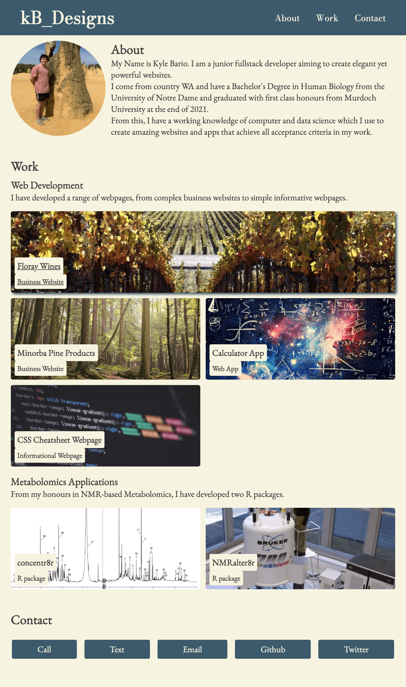

# kb_portfolio
A webpage portfolio detailing the fullstack work I have produced and launched.

## Contents

### About

Within the portfolio, there is a brief about me section describing my background and work experience.

### Work

Links to my work are then provided and organised into **web development** and **metabolomics**.

### Contact

Finally, a contact section with links to call or text my mobile, send me an email, visit my github or look at my twitter account.

## A Link and a Look

The link to my portfolio is [here](https://kbario.github.io/kb_portfolio/) and a screenshot of my portfolio can be seen below. 

